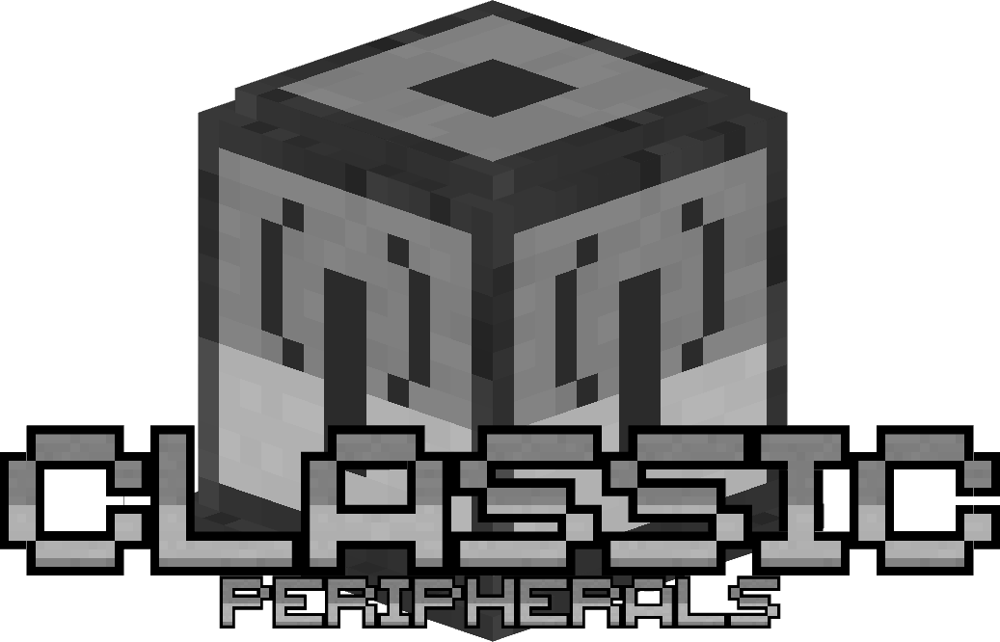

# 

Welcome to the **ClassicPeripherals** wiki!

Classic Peripherals is an addon for CC: Tweaked implementing various kinds of peripherals and tweaks to the mod, some of
which are inspired by older and no longer maintained addons.

## Download & install

Requires [CC: Tweaked ](https://modrinth.com/mod/cc-tweaked).

## Reporting issues

The issue tracker is available on the [GitHub repository](https://github.com/Ale32bit/ClassicPeripherals/issues).

## Discord

## How to contribute

ClassicPeripherals is open-source! You can contribute from the GitHub
repo [Ale32bit/ClassicPeripherals](https://github.com/Ale32bit/ClassicPeripherals).

## Donate!

